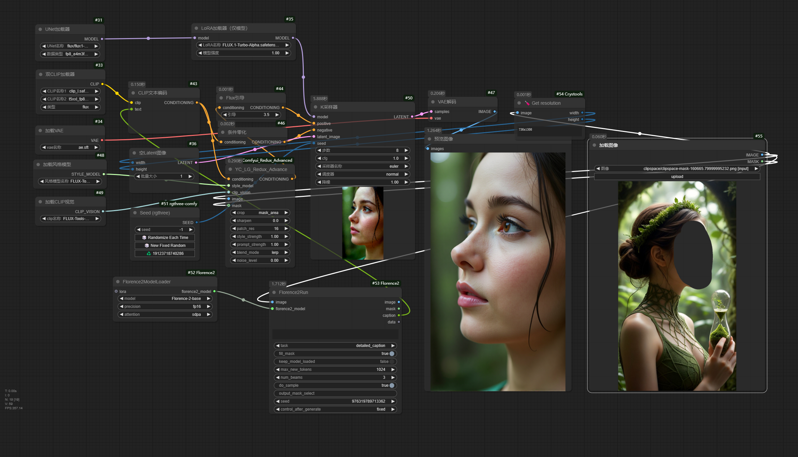

# 新增YC_LG_Redux节点

- "crop" "裁剪模式：center-中心裁剪, mask_area-遮罩区域裁剪, none-不裁剪"
- "sharpen" "锐化强度：负值为模糊，正值为锐化，0为不处理"
- "patch_res" "patch分辨率，数值越大分块越细致"
- "style_strength" "风格强度，越高越偏向参考图片"
- "prompt_strength" "文本提示词强度，越高文本特征越强"
- "blend_mode" "风格强度的计算方式：

      "lerp - 线性混合 - 高度参考原图"
      "feature_boost - 特征增强 - 增强真实感"
      "frequency - 频率增强 - 增强高频细节"

- "noise_level" "添加随机噪声的强度，可用于修复错误细节"

工作流图片（将工作流图片拖拽入comfyui界面即可）

# 旧版

Redux can be used with openpose  
The reference picture on the left below comes from Xiaohongshu blogger - Xiaoxiaona
下面的左边参考图来自小红书博主: 一只小小娜 (友情赞助)

关于我 | About me

Bilibili：[我的B站主页](https://space.bilibili.com/498399023?spm_id_from=333.1007.0.0)
QQ号：3260561522
wechat微信: DLONG189one

